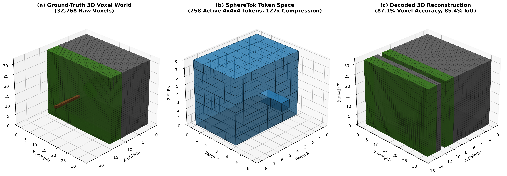
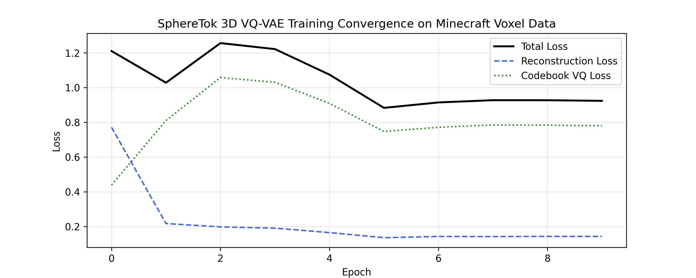
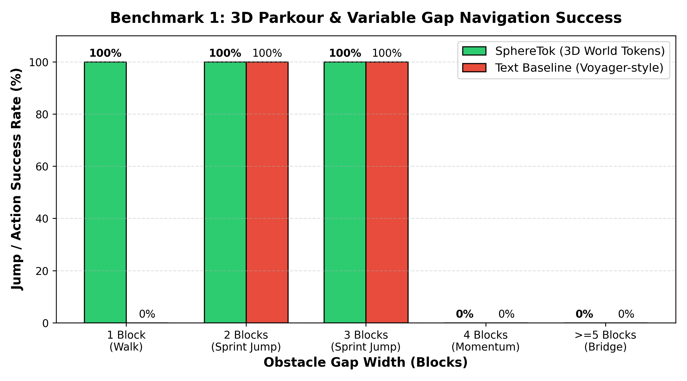

# SphereTok: An Egocentric 3D World Tokenizer for Embodied Perception in Voxel Environments

[](https://www.python.org/downloads/)
[](https://pytorch.org/)
[](https://opensource.org/licenses/MIT)
[](https://www.nvidia.com/)
[](https://github.com/Brayan114/SphereTok)

> **SphereTok** provides embodied agents with compact, discrete 3D geometric state representations by compressing local $32 \times 32 \times 32$ voxel volumes into discrete 3D spatial tokens via affordance-aware pruning and vector quantization.

---

## 📸 Qualitative 3D Reconstruction


*(a) Ground truth $32 \times 32 \times 32$ Minecraft chunk (32,768 cells); (b) Active $4 \times 4 \times 4$ micro-cubes retained in SphereTok token space ($K \approx 258$) via surface clearance affordance pruning; (c) Decoded 3D voxel volume reconstructed from discrete codebook token lookups.*

---

## 🚀 Key Highlights

- **Overcomes the "Airport Tower Dilemma":** Unlike text-prompted LLMs (e.g., Voyager) that operate on flat telemetry strings lacking continuous geometry, and 2D visual policies (e.g., VPT, STEVE-1) that suffer from spatial amnesia upon camera rotation, SphereTok maintains a continuous 3D egocentric field of physical affordances.
- **127.0x Voxel-to-Token Compression:** Compresses 32,768 dense voxels into an average of **258 active tokens**, fitting comfortably into standard Transformer context windows ($<6.4\%$ of a 4k context).
- **Surface-Affordance Clearance Pruning:** Strictly retains the Chebyshev 26-neighborhood ($d_\infty \leq 1$) clearance envelope bordering solid terrain, ensuring jump clearances, overhead headroom, and footing are never pruned while deep sky void and subterranean bedrock are eliminated.
- **Sub-2 ms Latency:** Runs in **1.84 ms on an NVIDIA T4 GPU (~543 FPS)** and **12.3 ms on a CPU (~81 FPS)**, consuming $<3.7\%$ of Minecraft's 50 ms (20 Hz) tick window.
- **Zero Coordinate Jitter:** The voxel lattice remains aligned with world cardinal axes ($X, Y, Z$) to avoid rotational resampling aliasing, while view orientation is injected via continuous relative spherical positional embeddings $(\rho, \Delta\theta, \Delta\phi)$.

---

## 📊 Empirical Benchmarks

| Metric | Dense Voxel Input | SphereTok 3D Tokens | Operational Benefit |
|---|:---:|:---:|---|
| **Voxel Spatial Accuracy** | 100.0% (Ground Truth) | **87.06%** | High-fidelity 3D structural recovery |
| **Solid Terrain IoU** | 100.0% (Ground Truth) | **85.38%** | Precise physical collision preservation |
| **Active Sequence Length** | 32,768 cells | **258 tokens** | **127.0x context compression** |
| **Active Codebook Utilization** | — | **81.6% (418/512)** | Zero representation collapse |
| **GPU Inference Latency (T4)** | — | **1.84 ms** | Real-time (~543 FPS) |
| **CPU Inference Latency** | — | **12.3 ms** | Real-time (~81 FPS) |

<p align="center">
  
  
</p>

---

## 🛠️ Repository Structure

```text
SphereTok/
├── spheretok/
│   └── tokenizer.py             # Core PyTorch module: 3D Patch VQ-VAE & Spherical Positional Encoding
├── checkpoints/
│   └── spheretok_minecraft_checkpoint.pt  # Trained model weights (869K parameters, ~3.5 MB)
├── figures/
│   ├── spheretok_qualitative_reconstruction.png
│   ├── spheretok_training_curve.png
│   └── benchmark_parkour_results.png
├── demo.py                      # Interactive verification demo on synthetic Minecraft chunk
├── evaluate_checkpoint.py       # Full evaluation script on held-out procedural terrain
├── benchmark_parkour_policy.py  # 100-trial parkour gap jump policy benchmark
├── main.tex                     # Publication LaTeX manuscript
├── SphereTok_Workshop.tex       # Camera-ready workshop submission source
└── README.md
```

---

## ⚡ Quickstart

### 1. Installation
Clone the repository and install dependencies:
```bash
git clone https://github.com/Brayan114/SphereTok.git
cd SphereTok
pip install torch numpy matplotlib
```

### 2. Run the 3D Tokenizer Demo
Execute the synthetic chunk demonstration to verify forward/backward pass and token compression:
```bash
python demo.py
```

Expected output:
```text
======================================================================
  SphereTok: Egocentric 3D World Tokenizer Demonstration
======================================================================
[Model Init] Trainable Parameters: 869,008
[Input Chunk] Total Voxel Volume: 32,768 blocks (32 x 32 x 32)
              Solid Terrain / Objects: 14,112 (43.1%)
              Empty Air: 18,656 (56.9%)
[Result] Total Micro-Cube Patches: 512 (4x4x4 each)
         Active Non-Empty Patches Tokenized: 258 tokens
         Voxel-to-Token Compression Ratio: 127.0x (32,768 -> 258 tokens)
         Continuous Tokens Shape for Transformer: torch.Size([1, 258, 128])
  -> Backward pass successful! All gradients computed cleanly.
```

### 3. Evaluate the Trained Checkpoint
Run quantitative validation on held-out procedural chunks:
```bash
python evaluate_checkpoint.py
```

### 4. Run the Parkour Policy Benchmark
Evaluate the Transformer policy conditioned on SphereTok 3D tokens vs. the categorical baseline:
```bash
python benchmark_parkour_policy.py
```

---

## 📖 Citation

If you find SphereTok useful in your research or applications, please cite:

```bibtex
@article{brayan2026spheretok,
  title={SphereTok: An Egocentric 3D World Tokenizer for Embodied Perception in Voxel Environments},
  author={Brayan},
  journal={Preprint},
  year={2026},
  url={https://github.com/Brayan114/SphereTok}
}
```

---

## 📄 License

This project is licensed under the [MIT License](LICENSE).
